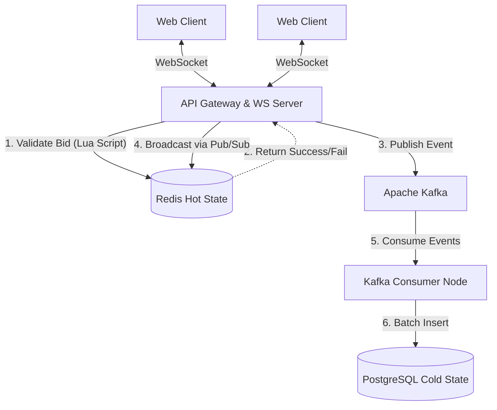

# ArtMart: Real-Time High-Throughput Bidding Engine

> A high-performance, event-driven distributed system for live auction bidding.

## Project Overview
ArtMart is a high-frequency real-time auction platform designed to handle thousands of concurrent bids with sub-millisecond latency. Built to solve the concurrency challenges of live bidding (e.g., race conditions, delayed updates, and database bottlenecks), this system decouples state validation from persistence using an event-driven architecture. 

It is technically interesting because it employs **Redis Lua scripting** for atomic bid validation (preventing race conditions) and **Apache Kafka** for asynchronous database writes, allowing the system to handle massive traffic spikes during the final seconds of an auction without dropping connections or blocking the main thread.

## Key Features
- **Real-Time Bidding via WebSockets**: Bi-directional communication ensures all connected clients receive bid updates in less than 50ms without HTTP overhead or polling delays.
- **Atomic Bid Validation (Anti-Sniping)**: Uses Redis Lua scripts to execute atomic locks and validate incoming bids. If a bid is placed in the final 60 seconds, the auction is automatically extended.
- **Event-Driven Persistence**: High-throughput bid traffic is offloaded to Apache Kafka, decoupling the hot path (Redis/WebSockets) from cold storage (PostgreSQL).
- **Scalable Architecture**: Dockerized microservices topology, easily horizontally scalable.
- **Observability & Telemetry**: Integrated Prometheus and Grafana for tracking active connections, bid throughput, and API latency.

## Architecture Overview
The system is divided into two primary execution paths:
1. **The Hot Path (Real-time Validation & Broadcast)**: Handles incoming WebSocket traffic, validates state in Redis, and broadcasts updates via Redis Pub/Sub.
2. **The Cold Path (Asynchronous Persistence)**: A Kafka consumer micro-batch processes bid events and persists them to PostgreSQL for historical record-keeping.



## Tech Stack
| Component | Technology | Rationale |
|-----------|-----------|-----------|
| **Frontend** | React, Vite, Tailwind CSS | Fast compilation, reactive state management, and modern UI. |
| **Backend API** | Node.js, Express.js | Non-blocking I/O ideal for handling thousands of concurrent WebSocket connections. |
| **Real-Time Comm** | `ws`, Redis Pub/Sub | Low-latency bi-directional streaming and cross-instance messaging. |
| **Hot Storage** | Redis (Lua Scripts) | In-memory datastore for sub-millisecond atomic operations and distributed locking. |
| **Message Broker** | Apache Kafka | Highly durable distributed commit log for decoupling high-throughput writes. |
| **Cold Storage** | PostgreSQL | ACID-compliant relational database for long-term historical records and user data. |
| **Observability** | Prometheus, Grafana | Scraping runtime metrics (active WS connections, API latency) and visualizing telemetry. |
| **Infrastructure** | Docker, Docker Compose | Containerized environments for reproducible deployments. |

## Project Structure
```text
.
├── backend/
│   ├── config/            # Configs for Prometheus
│   ├── src/
│   │   ├── server.js      # API Gateway, WebSocket Server, Redis Lua Scripts
│   │   └── consumer.js    # Kafka Consumer for DB persistence
│   ├── tests/             # Unit, Integration, and Load Tests
│   └── Dockerfile
├── frontend/
│   ├── src/
│   │   ├── components/    # Reusable UI components
│   │   ├── hooks/         # Custom React hooks (e.g., useWebSocket)
│   │   └── pages/         # Page layouts (AuctionDetail, Dashboard)
│   └── Dockerfile
└── docker-compose.yml     # Orchestrates Postgres, Redis, Kafka, API, and UI
```

## Request Flow
1. **Connection**: User loads the `AuctionDetail` page. React establishes a WebSocket connection to the Node.js backend.
2. **Action**: User places a bid. The payload is sent via WebSocket to avoid HTTP handshake overhead.
3. **Validation (Redis)**: The backend receives the bid and executes a **Lua Script** in Redis. This script atomically checks if the bid is higher than the `current_highest_bid` and checks if the auction has expired.
4. **Anti-Sniping**: If the bid is valid and placed within 1 minute of expiration, the Lua script extends the auction expiry to prevent sniping.
5. **Event Streaming (Kafka)**: If valid, the backend publishes a `BID_PLACED` event to a Kafka topic.
6. **Broadcasting (Pub/Sub)**: The backend publishes the updated bid to a Redis Pub/Sub channel. All backend instances subscribed to this channel instantly push the update to their connected WebSocket clients.
7. **Persistence (Postgres)**: The isolated Kafka Consumer picks up the `BID_PLACED` event and micro-batches an `INSERT` into PostgreSQL for durable history.

## Installation & Setup

### Prerequisites
- Docker and Docker Compose
- Node.js 18+ (for local bare-metal development)

### Environment Setup
Create a `.env` file in the `./backend` directory:
```env
PORT=3000
REDIS_HOST=127.0.0.1
REDIS_PORT=6379
DB_HOST=127.0.0.1
DB_USER=your_db_username
DB_PASSWORD=your_db_password
DB_NAME=bidding_engine
KAFKA_BROKERS=localhost:9092
JWT_SECRET=your_super_secret_key
```

### Running with Docker Compose (Recommended)
This spins up the entire distributed system, including Kafka, Zookeeper, Redis, PostgreSQL, Prometheus, Grafana, and the Node.js microservices.
```bash
docker-compose up --build -d
```

- **Frontend Application**: `http://localhost:80`
- **Backend API**: `http://localhost:3000`
- **Grafana Dashboards**: `http://localhost:3001` (admin/admin)
- **Prometheus Metrics**: `http://localhost:9090`

## API Overview
- `GET /api/auctions` - Fetch catalog of all active/ended auctions.
- `GET /api/auctions/:id` - Fetch details for a specific auction lot.
- `GET /api/auctions/:id/history` - Retrieve historical bids (from Postgres).
- `GET /api/bids/me` - Retrieve all highest active bids placed by the authenticated user.
- `POST /api/auth/login` - Authenticate user and issue JWT.

*Note: Bidding operations bypass the REST API and are handled exclusively via WebSockets for latency optimization.*

## Database Design
- **Users Table**: Stores user authentication and profile data.
- **Auctions Table**: Stores auction metadata (title, category, current highest bid, expiration, status).
- **Bids Table**: A hyper-scale append-only ledger storing every valid bid attempt.
  - *Design Decision*: We use `DISTINCT ON (auctionId)` when querying `/api/bids/me` to efficiently retrieve the user's maximum bid per auction without pulling thousands of rows into memory.

## Monitoring & Observability
- **Prometheus**: Scrapes `/metrics` from the Node.js backend. Tracks active WebSocket connections (`bidding_active_connections`), HTTP request durations, and Kafka producer throughput.
- **Grafana**: Visualizes the Prometheus metrics, providing insights into load spikes and system health during an active auction.

## Engineering Decisions
1. **Redis Lua Scripting over SQL Transactions**: Validating bids in PostgreSQL during peak load leads to row-level locking contention. Moving state validation into Redis memory ensures sub-millisecond O(1) atomicity.
2. **WebSockets over Server-Sent Events (SSE)**: Bidding requires bidirectional communication with the lowest possible overhead. WebSockets prevent the TCP handshake overhead of standard HTTP POST requests.
3. **Kafka Event Sourcing**: Offloading database writes to a message broker ensures the WebSocket server never blocks waiting for an I/O disk write to finish, maximizing concurrency.

## Challenges & Solutions
**Challenge**: React state batching causing skipped frames/messages when 100+ bids arrive per second.
**Solution**: Implemented a highly stable `useWebSocket` custom hook that uses `useCallback` to bypass React's render cycle limitations. Combined with micro-batching on the Kafka consumer, the UI remains responsive without tearing.

**Challenge**: Duplicate bids in "My Bids" history due to multiple attempts on the same lot.
**Solution**: Refactored the SQL query to leverage PostgreSQL's `DISTINCT ON` operator, pushing the heavy grouping computation down to the database engine.

## What This Project Demonstrates
- **System Design & Distributed Architecture**: Decoupling state validation from persistence.
- **High-Performance Computing**: Designing for high throughput and low latency.
- **Concurrency Control**: Preventing race conditions using atomic in-memory locks.
- **Real-Time Communication**: Managing stateful WebSocket connections at scale.
- **Observability**: Instrumenting a system to emit standard telemetry.

## Future Improvements
- **Redis Cluster**: Sharding the Redis cache to support horizontal scaling of the hot state.
- **Kubernetes Migration**: Writing Helm charts to replace Docker Compose for true distributed cluster orchestration.
- **Bid Replay**: Utilizing Kafka's event retention to build an "auction replay" feature for completed lots.

## Screenshots

| Live Bidding Interface | Dashboard Overview |
|:---:|:---:|
| *(Add GIF of realtime bidding here)* | *(Add screenshot of Dashboard here)* |
| Grafana Telemetry | Mobile Responsive View |
| *(Add screenshot of Grafana Dashboards here)* | *(Add screenshot of Mobile UI here)* |
